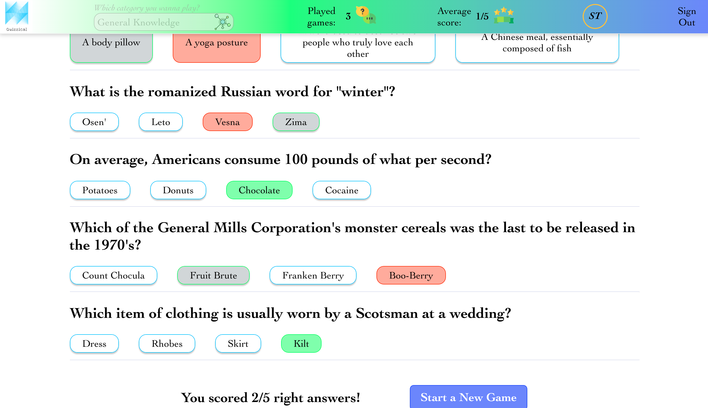

# Quizzical
https://quizzical-game.herokuapp.com

<h2>Quizzical is a full-stack web app</h2>
<h3>Quizzical is an online game built on the API provided by Open Trivia DataBase</h3>

<h2>Motivation</h2>
I started to develop Quizzical as the solo final project of the React course provided by Scrimba https://scrimba.com/ and taught by Bob Ziroll. 
The requirements were just about the frontend side. However, I saw good rooms to improve the app and decided to serve it by the backend. Using a server was a must to allow players to monitor their scores and incentivize them to play more games an to improve their scores. 

<h2>Technologies</h2>
<h3>Frontend</h3>
For the frontend, the application relies mostly on CSS3 and JSX due to the use of the REACT framework. This application has been the first one that I developped using React. 
On top of CSS3, I relied on Tachyons https://tachyons.io libraries for the SignIn and Register form; also on Sass to create tooltips and animate them. 

<h3>Backend</h3>
For the backend, I use NODE.js powered with EXPRESS.js. In addiction, I relied on few npm extensions: 1. BodyParser https://www.npmjs.com/package/body-parser as the middleware to enable the communication and data exchange between the frontend and the backend; 2. KNEX.js https://knexjs.org to powered Node.js and create better queries; 3. BCRYPT https://www.npmjs.com/package/bcrypt to encrypt users'passwords and guarentee security; 4. CORS https://www.npmjs.com/package/cors the package for providing the Express middleware that can be used to enable CORS with various options.
To test the server requests I relied on Postman https://www.postman.com. 

<h3>Database</h3> 
To mantain the data for users'profile and for their games and scores, I use the relational database PostegreSQL. To work better with it I relied on the database tool DBeaver https://dbeaver.io. On the matter, I structured the database by creating to tables: 1. Login 2. Users. They communicate between them through the common value (EMAIL). 
